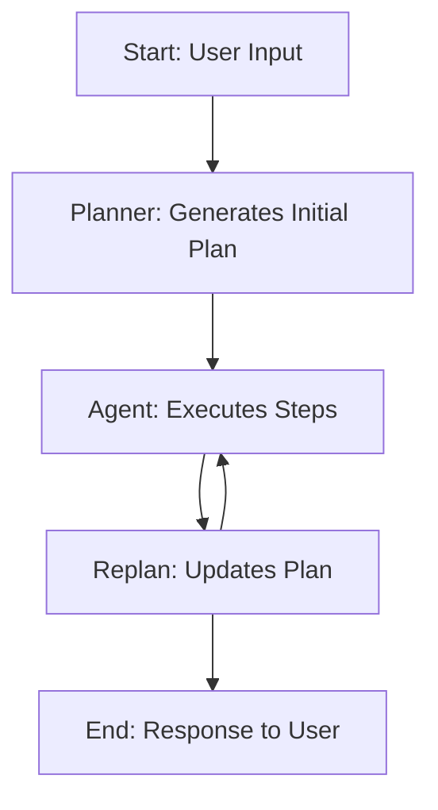

# Alfred: Scaling Local Climate Solutions
Alfred is an AI-powered assistant designed to create impactful, measurable, and actionable bounties for climate and sustainability initiatives. Built with a modular multi-agent architecture, Alfred simplifies the traditionally manual process of planning, executing, and refining bounties, empowering funders and local communities to drive meaningful change.

- [Motivation](#motivation---using-global-rails-for-local-challenges-in-climate-and-sustainability)
- [Impact Miner](#impact-miner---scaling-impact-of-last-mile-funding)
- [Friction](#friction---crafting-measurable-high-impact-bounties)
- [Opportunity](#opportunity---role-of-agentic-ai-in-decentralized-solutions)
- [Architecture](#architecture---the-ultimate-bounty-master-alfred)
- [Tooling](#tooling---langgraph-as-an-orchestration-engine)
- [Version 0](#version-0---technical-notes)
- [How can you contribute?](#how-can-you-contribute)

### Motivation - Using global rails for local challenges in climate and sustainability
The Atlantis team has witnessed firsthand the devastating impacts of climate shocks in India, disrupting vital systems like water, energy, and food. The core challenge in addressing climate change isn’t technology—it’s coordination. Our [pilot in rural India](https://medium.com/mercy-corps-social-venture-fund/pilot-insights-improving-clean-water-access-via-decentralized-web3-networks-c9f3931f2050) showed the potential of decentralized solutions to enhance resilience, affordability, and transparency. However, gaps in coordination, trust, and verification persist. Blockchain provides a transparent, scalable framework to align global resources with local climate action, empowering communities to take ownership and drive meaningful impact.

[Read more...](./docs/1%20-%20motivation.md)

### Impact Miner - Scaling impact of last mile funding
Impact Miner by Atlantis is an on-chain bounties platform ([Android](https://play.google.com/store/apps/details?id=com.company.atlantis&hl=en_IN&pli=1), [iOS](https://apps.apple.com/in/app/impact-miner/id6448894610)), that connects climate impact funders, sustainability organizations, and green gig workers. It ensures transparent, verifiable impact reporting, affordable certification, and efficient fund delivery. Contributions are tracked through NFTs backed by real-world validated actions.

Who benefits?
- Impact Funds: Deploy capital efficiently with real-time, transparent data.
- Sustainability Organizations & Workers: Gain easy access to funding with reduced costs.
- Local Communities: Receive more direct funding for scalable, impactful climate actions.

[Read more...](./docs/2%20-%20impact-miner.md)

### Friction - Crafting measurable high impact bounties
Creating effective bounties is time-consuming, requiring clear scopes, measurable success metrics, and significant manual effort—especially for newly onboarded communities. Through workshops with funders, we identified key questions to streamline bounty design:
- Is the goal well-defined, realistic, and aligned with local needs?
- Are success metrics measurable and actionable?
- Can the goal be broken into milestones?
- Does the design account for uncertainties and ensure transparency?
- Are all stakeholders included in the process, and do incentives encourage meaningful participation?
- Addressing these challenges is critical to making bounties impactful, scalable, and adaptive to real-world constraints.

[Read more...](./docs/3%20-%20friction.md)

### Opportunity - Role of agentic AI in decentralized solutions
Hands-on workshops for designing bounties are impactful but not scalable. To address diverse community needs at scale, we are leveraging AI-powered workflows to embed best practices, contextual insights, and dynamic decision-making into the bounty creation process.
Our AI-assisted system will guide funders with:
- Contextual nudges for defining objectives, scopes, and milestones.
- Templates and recommendations informed by collective knowledge.
- A multi-modal assistant offering real-time guidance and seamless interaction.
This approach lowers barriers, enhances scalability, and empowers stakeholders to create impactful bounties independently, transforming decentralized solutions into catalysts for collective action.

[Read more...](./docs/4%20-%20opportunity.md)

### Architecture - The ultimate bounty master: Alfred
Alfred is an AI-powered assistant designed to simplify and streamline the creation of impactful bounties for climate and sustainability. Built with a modular, multi-agent architecture, Alfred leverages Agentic AI to transform complex, manual processes into an intuitive and scalable experience.
Key Features:
- Planning Agent: Breaks aspirations into actionable milestones with measurable goals.
- Execution Agent: Provides localized, practical solutions to ensure feasibility.
- Feedback & Iteration: Dynamically refines plans for transparency and adaptability.
- Knowledge Base: Offers data-driven insights to enhance decision-making.
  
[Read more...](./docs/5%20-%20architecture.md)

### Tooling - Langgraph as an orchestration engine
Alfred uses LangGraph, a robust orchestration framework, to power its stateful, multi-agent workflows. LangGraph’s key features include:
- Dynamic Flows: Supports complex logic like loops and conditionals for responsive agent behaviors.
- State Persistence: Automatically saves progress, enabling seamless pausing, resumption, and error recovery.
- Human-in-the-Loop: Allows critical interventions and approvals for enhanced decision-making.
- Real-Time Feedback: Provides streaming outputs for better user engagement and responsiveness.
- Ecosystem Integration: Works seamlessly with LangChain and LangSmith to leverage diverse tools and models.
- LangGraph ensures Alfred’s workflows are adaptable, scalable, and optimized for creating effective, measurable bounties.

[Read more...](./docs/6%20-%20tooling.md)

### Version 0 - Technical notes
Alfred v0 is our MVP launched for testing and validation with a small group of users.

Key Workflow Highlights:

- Planner: Creates step-by-step plans using LLM-powered logic.
- Agent: Executes steps and processes results.
- Replan: Dynamically updates plans based on progress.
- Logic: Adapts workflows using conditional decision-making.

[Read more...](./docs/7%20-%20version0.md)

### How can you contribute?
We’re excited to have you join us in shaping Alfred into a powerful tool for climate and sustainability solutions. As we test our MVP (v0), your feedback and contributions are critical to its evolution. Whether you’re a developer, designer, researcher, or just someone passionate about climate action, there’s a way for you to contribute.

**Running Locally**
1. Clone the repository:
    `git clone https://github.com/AtlantisDAO1/Alfred.git` 
    `cd Alfred`
2. Install dependencies and run the application:
     `pip install -r requirements.txt`
     `streamlit run ./app/alfred.py`
4. Open your browser and navigate to `http://localhost:8501`.

**Deploying the App on Streamlit Cloud**
1. Log in to Streamlit Cloud.
2. Create a new app and connect it to your GitHub repository.
3. Add the `OPENAI_API_KEY` and `TAVILY_API_KEY` in the "Secrets" section of the Streamlit Cloud dashboard.
4. Deploy the app.

Let us know about bugs, errors, or confusing user experiences by raising an issue in our [Github](https://github.com/AtlantisDAO1/Alfred/issues).

[Read more...](./docs/8%20-%20contribute.md)

