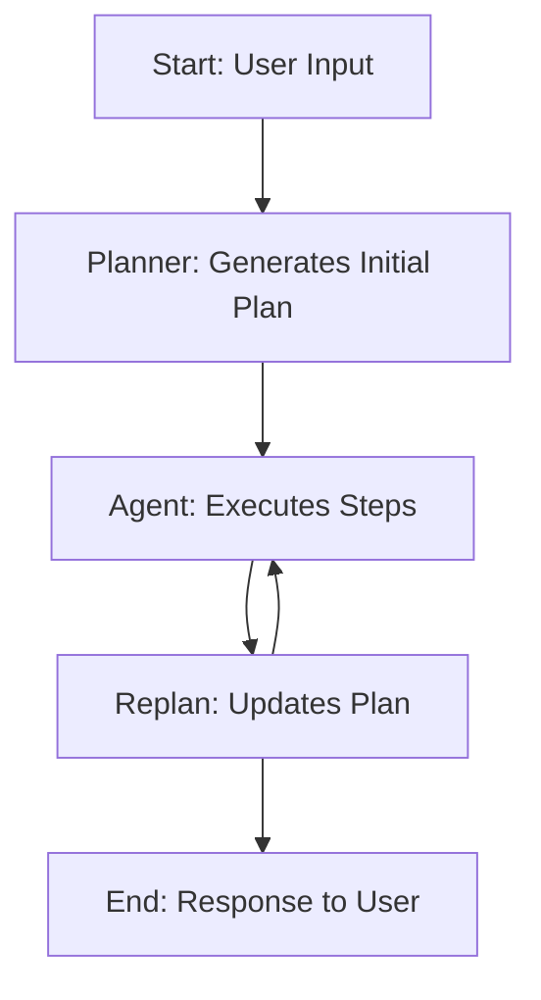

### Version 0 - Technical Notes

Alfred v0 follows a structured workflow to turn your funding ideas into well-defined, actionable bounties. Think of it as a virtual assistant that helps you plan every detail, track progress, and adjust as needed—all while keeping everything simple and organized.

Alfred v0 employs a **multi-agent modular system** built with LangGraph to handle the iterative planning, execution, and refinement of bounties. Below is the high-level architecture:

**Workflow Highlights:**
- **Planner Node:** Generates an initial step-by-step plan based on user input using a structured LLM-powered planner.
- **Agent Node:** Executes individual steps in the plan and processes the results.
- **Replan Node:** Updates the plan dynamically based on progress and ensures the workflow adapts to changing requirements.
- **Conditional Logic:** Determines whether the process ends or loops back for further execution.

**Components and Dependencies:**
- **Tools:**    
    - `TavilySearchResults`: Enables contextual search with a maximum of three results per query.
- **LLM Models:**
    - **ChatOpenAI (`gpt-4-turbo-preview`):** Drives the agent's execution for step-specific tasks.
    - **Planner & Replanner:** Powered by `gpt-4o` with structured outputs.
- **Dependencies:**
    - **LangGraph:** Core workflow orchestration.
    - **LangChain:** Handles prompt templating and LLM interaction.
    - **Streamlit:** Provides the user interface for input and output.

**Current Limitations:**
- Static step execution without human intervention.
- Simplistic search and planning capabilities for specific scenarios.

**Planned Enhancements:**
- Allows manual adjustments during planning phases
- Embed insights to guide users during planning.
- Tailor prompts based on user roles and project types.
- Support for conversational memory
